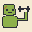

<p align="center">
  
</p>

# ZombieJox

> Your JaxJox dumbbells aren't dead. They just need a new brain.

Open-source Flutter replacement for the discontinued JaxJox Connect app.
For owners of DumbbellConnect, KettlebellConnect, and friends whose
weights went silent when JaxJox went into administration.

---

## The story

In early 2025 JaxJox went into administration. The app vanished from
both stores. The dumbbells you paid $300 for were, overnight, not smart anymore —
weight stuck wherever it last landed, no way to change it without the
app, no app to install.

**ZombieJox is a new brain attached to  the corpse.**
Same hardware. New app. No cloud, no subscription,
no telemetry, no account.

## Status

| Product                     | Code   | Status                           |
|-----------------------------|--------|----------------------------------|
| DumbbellConnect             | DB200  | 🟡 In progress                   |
| KettlebellConnect 2.0       | KB200  | 🟡 Protocol known, untested      |
| KettlebellConnect (legacy)  | KB42   | 🟡 Protocol known, untested      |
| FoamRollerConnect           | FR100  | ⚪ Not yet                       |
| PushUpConnect               | PB220  | ⚪ Not yet                       |
| Chileaf-branded HRMs        | CL8xx  | ⚪ Not yet                       |

If you have one of the untested devices and want to help, open an issue.

## What it does

- Nothing, really. Early days...


## What it doesn't do (yet)

- Scans for and connects to your JaxJox device over BLE
- Sets weight remotely (8–50 lbs on dumbbells)
- Reads current weight, battery, firmware version
- Works on both Android and iOS

## What it wil never do

- Workout tracking, exercise library, social features, "Fitness IQ"
  scores, training plans — none of it. The original app's cloud is
  gone anyway. ZombieJox is a weight controller, nothing more.

## Install

**Android:** Download the APK from [Releases](#) and sideload.
Google Play won't host an unofficial app for orphaned hardware.

**iOS:** TestFlight link in [Releases](#).

Or build from source:

## Build from source

```bash
git clone https://github.com/rbp/zombiejox
cd zombiejox
flutter pub get
flutter run
```

## How it works

The original app talked to the dumbbells over a custom BLE protocol
on service UUID `AAE28F00-71B5-42A1-8C3C-F9CF6AC969D0`. We
reverse-engineered the protocol from the decompiled APK and recovered
the native checksum algorithm by disassembling `libfitness.so` with
`llvm-objdump`. Full protocol spec is in [`docs/ble_protocol.md`](docs/ble_protocol.md).

There's no auth on the dumbbells — they'll talk to anyone who can
frame a packet correctly.

## FAQ

**Q: Is this affiliated with JaxJox?**
No. JaxJox the company is in administration. ZombieJox is an
independent community project for people who'd rather not throw $300
of hardware in a landfill.

**Q: Why the zombie name?**
Because the dumbbells were dead and now they aren't.

**Q: Will this brick my dumbbells?**
Highly unlikely — we only send commands the official app already
sent. But: this is hobbyist software with no warranty. Don't expect
support.

**Q: I have a Chileaf heart rate monitor that worked with the
original JaxJox app. Will it work here?**
Not yet. The Chileaf protocol is in scope but not implemented; PRs
welcome.

## Credits

- **Eamon Tuhami / X8IQ LTD** — proved the protocol was workable
  with the iOS-only "JaxJox Connect" app, before this project existed
- The original JaxJox engineering team — the hardware is solid, sorry
  the company didn't make it
- Everyone who's owned bricked smart-fitness equipment and wondered
  if it had to be that way

## License

GPLv3 (TBD — confirm before first release)

## Disclaimer

ZombieJox is not affiliated with JaxJox, its administrators, or any
successor entity. Provided as-is, no warranty. Don't drop your dumbbells.
